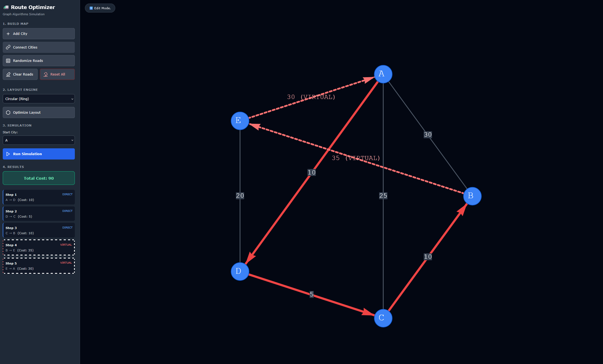

# Logistic Route Optimizer: A Graph-Theoretic Approach to Pathfinding

<p align="center">
  
</p>

## Abstract
This project implements a visual simulation of the **Metric Traveling Salesman Problem (TSP)** to optimize logistic delivery routes. By leveraging the **Floyd-Warshall algorithm** for metric closure and a **Greedy Nearest Neighbor** heuristic for path selection, the application demonstrates how theoretical graph algorithms can be applied to real-world logistic constraints. The system provides an interactive web interface for constructing, visualizing, and solving dynamic graph topologies.

## 1. Introduction
Efficient routing is a cornerstone of modern logistics. The challenge lies in determining the shortest possible route that visits a set of locations exactly once and returns to the origin. This application serves as both a pedagogical tool and a proof-of-concept for solving these routing complexities using a **complete metric graph** approach.

## 2. Methodology & Algorithms

The core logic of the optimizer relies on a two-stage algorithmic process:

### 2.1. Metric Closure (Virtual Road Generation)
In real-world geography, direct paths between all cities do not always exist. To solve this, the application first computes the **Metric Closure** of the graph.
* **Algorithm:** Floyd-Warshall.
* **Function:** It calculates the shortest path between all pairs of nodes ($u, v$). If no direct edge exists, it creates a "Virtual Edge" (represented by dashed red lines) with a weight equal to the shortest path through intermediate nodes.
* **Result:** A fully connected graph satisfying the triangle inequality ($cost(u, v) \leq cost(u, w) + cost(w, v)$).

### 2.2. Route Optimization (TSP Solver)
Once the graph is complete (metric closure), the application solves the TSP.
* **Algorithm:** Greedy Nearest Neighbor / Heuristic Search.
* **Process:** Starting from the defined `Source` node, the algorithm iteratively selects the unvisited node with the minimum edge weight.
* **Output:** An ordered Hamiltonian Cycle representing the optimal delivery route.

## 3. System Architecture

The application is built as a Single Page Application (SPA) to ensure reactive performance and real-time visualization.

* **Frontend Framework:** React.js (Vite)
* **Graph Rendering Engine:** Vis.js (Physics-based force-directed layout)
* **State Management:** React Hooks (`useState`, `useRef`) for O(1) access to graph data structures.
* **Styling:** Modular CSS-in-JS with a dark-mode UI optimized for data visibility.

## 4. Features & Controls

The interface is designed to allow rapid prototyping of network graphs.

| Feature | Description |
| :--- | :--- |
| **Interactive Construction** | Users can add nodes and define weighted edges dynamically. |
| **Rapid Connect Mode** | A toggleable "Edit Mode" allowing sequential clicking to connect cities instantly. |
| **Integrity Safeguards** | Logic prevents duplicate edges between nodes to maintain graph validity. |
| **Layout Engines** | Includes **Organic** (Physics), **Force Atlas** (Gravity), **Hierarchical** (Tree), **Circular**, and **Grid** layouts. |
| **Simulation** | Visualizes the active path with directional animations and a step-by-step cost log. |

## 5. Installation & Usage

To replicate the simulation environment locally:

1.  **Clone the Repository:**
    ```bash
    git clone [https://github.com/your-username/Logistic-Route-Optimizer.git](https://github.com/your-username/Logistic-Route-Optimizer.git)
    cd Logistic-Route-Optimizer
    ```

2.  **Install Dependencies:**
    ```bash
    npm install
    ```

3.  **Launch Application:**
    ```bash
    npm run dev
    ```

## 6. Future Work
Current implementation relies on greedy heuristics which provide an $O(n^2)$ approximation. Future iterations will explore exact algorithms (Held-Karp) for smaller graphs ($N < 20$) and genetic algorithms for larger datasets.

---
*Developed as part of a research initiative on Algorithmic Graph Theory.*